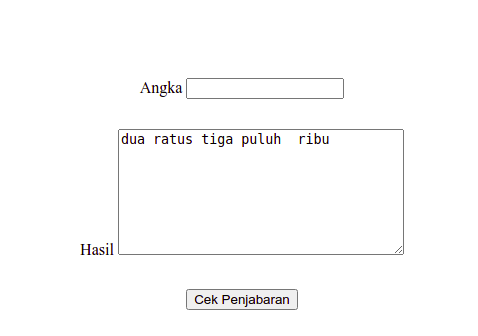

# Library Penjabaran Rupiah

## Tentang Library
Library penjabaran nilai rupiah ini, ialah salah satu library yang berfungsi untuk menjabarkan secara otomatis nominal uang yang kita inputkan, salah satu contohnya ialah sebagai berikut :

```
Rp.1.000.000,00 => Satu Juta Rupiah
```

## Instalasi
```
git clone https://github.com/Nofrisdan/library_penjabaran_rupiah.git
```
## SCRIPT MENGUBAH FORMAT RUPIAH
```
 document.getElementById("nilai_perolehan").addEventListener("keyup", function() {
        this.value = formatRupiah(this.value, "Rp");
    })
    /* Fungsi formatRupiah */
    function formatRupiah(angka, prefix) {
        var number_string = angka.replace(/[^,\d]/g, '').toString(),
            split = number_string.split(','),
            sisa = split[0].length % 3,
            rupiah = split[0].substr(0, sisa),
            ribuan = split[0].substr(sisa).match(/\d{3}/gi);

        // tambahkan titik jika yang di input sudah menjadi angka ribuan
        if (ribuan) {
            separator = sisa ? '.' : '';
            rupiah += separator + ribuan.join('.');
        }

        rupiah = split[1] != undefined ? rupiah + ',' + split[1] : rupiah;
        return prefix == undefined ? rupiah : (rupiah ? 'Rp. ' + rupiah : '');
    }


```

## Gambar Penggunaan
### Gambar 1


### Gambar 2



