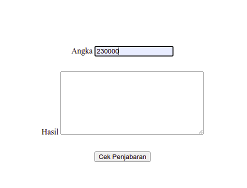

# Library Penjabaran Rupiah

## Tentang Library
Library penjabaran nilai rupiah ini, ialah salah satu library yang berfungsi untuk menjabarkan secara otomatis nominal uang yang kita inputkan, salah satu contohnya ialah sebagai berikut :

```
Rp.1.000.000,00 => Satu Juta Rupiah
```

## Instalasi
```
git clone https://github.com/Nofrisdan/library_penjabaran_rupiah.git
```

## Gambar Penggunaan
### Gambar 1


### Gambar 2


